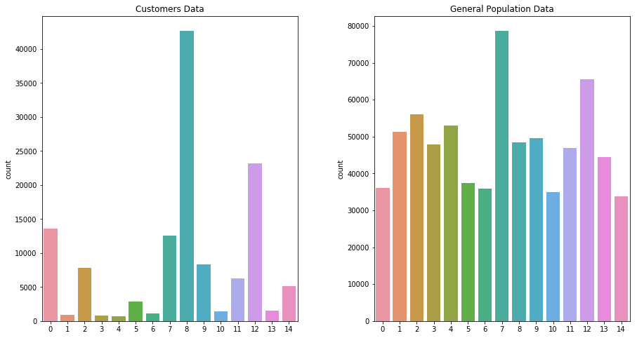

# Identify Customer Segments

## Table of Contents

1. [Project Motivation](#motivation)
2. [File Descriptions](#files)
3. [Results](#results)
4. [Required Libraries](#libraries)
5. [Licensing, Authors, Acknowledgements](#acknowledgements)

## Project Motivation 

In this project, I applied unsupervised learning techniques on demographic 
and spending data for a sample of German households. 
I preprocessed the data, applied dimensionality reduction techniques, and 
implemented k-means clustering algorithms to segment customers with the goal of optimizing customer outreach for a mail order company.

## File Descriptions 
`Identify_Customer_Segments.ipynb` and `Identify_Customer_Segments.html`: 
a Jupyter notebook and an HTML file, contain the whole project code to identify customer segments.

## Results 
The graph below compares the proportion of the data in each cluster for the customer data to the general population data,

 As a result, cluster 8 is popular with the mail-order company, while cluster 4 is unpopular with the company. 
 
**Most people of cluster 8 have the following characteristics:**
- males aged more than 45 years old
- very high money-savers, investors, and inconspicuous
- conservatives neighborhood
- average share of unemployment in community

**Most people of cluster 4 have the following characteristics:**
- females aged more than 30 years old
- very high low financial interest and be prepared
- traditional workers neighborhood
- high Share of unemployment in community

## Required Libraries 

- Pandas, NumPy, Scikit-learn (Machine Learning Libraries)
- Matplotlib and Seaborn (Data Visualization Libraries)
- random

## Licensing, Authors, Acknowledgements 
Credits must be given to Udacity and Arvato Bartlesmann for providing the data and design for this project.
